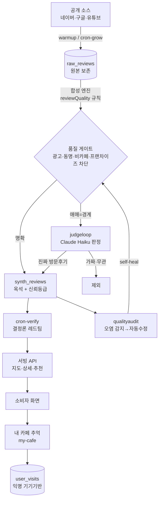

# 동네 커피 노트 — 전체 서비스 & 에이전트 지도

> 사장님이 서비스 전체와 "어떤 에이전트가 언제 무엇을 하는지"를 한눈에 파악하기 위한 문서.
> 사실 출처: 실제 코드(`web/app`, `web/scripts`, `vercel.json`)와 launchd 설정. 추측 없음.
> 최종 갱신: 2026-06-13

---

## 0. 한 문장 요약

> **공개 후기(네이버·구글·유튜브)를 모아 → 규칙으로 옥석을 가리고 → AI가 진짜 방문후기만 최종 검증해서 → 지도/추천으로 보여주고, 사용자는 자기가 다녀온 카페의 추억을 익명으로 기록·보관하는 서비스.**

---

## 1. 제품 구조 (무엇을 보여주나)

```
동네 커피 노트
├─ ① 소비자(B2C) — 지도/추천
│    · 검증된 후기로 우리 동네 카페를 고름 (별점 나열 X)
│    · 결(조용/작업/디저트/로스팅) 필터, 뜨는 카페, 스페셜티 픽
│    · 카페 상세: 신뢰등급 + 근거 후기(형광펜 강조) + 유튜브
│
├─ ② 내 카페 추억 (MY PIN) — 사용자 개인 기록
│    · 내가 다녀온 카페를 ❤로 지도에 기록 (위치 인증 기반)
│    · 추억 텍스트·사진·즐겨찾기 / 무가입·개인정보 0
│    · 백업코드·PDF/JSON 내보내기·공용 PC PIN 잠금
│
└─ ③ 사장님(B2B) — 카페 경쟁력 진단
     · 검증된 후기 기반 액션플랜·성격축
     · 쇼케이스(홍보) 등록, 구독(현재 관리자 전용 게이트)
```

핵심 원칙: **모든 숫자·후기에는 출처·근거가 붙는다. 지어내지 않는다.** (`PRINCIPLES.md` §1)

---

## 2. 데이터 파이프라인 (원본 → 화면까지)

```
 [외부 공개 소스]            [수집]          [정제·합성]          [검증]              [서빙]
 네이버 검색 후기  ─┐
 구글/웹 인덱스    ─┼──▶ 수집 에이전트 ──▶ 합성 엔진 ──▶ ① 규칙 품질필터 ──▶  지도/추천 API
 유튜브 공개영상   ─┘     (warmup,          (synthStore,      ② AI 판정(Haiku)      cafe-detail
                          cron-grow)         reviewQuality)    ③ 레드팀 검증         my-cafe ...
                                                  │            ④ 품질 감사
                                              raw_reviews ──────────────┐
                                              (원본 보존, 감사·재현용)   │
                                                                        ▼
                                                            오염 발견 시 자동 재처리(self-heal)
```

- **raw 보존**: 모든 외부 응답 원본을 DB(`raw_reviews`)에 남겨, 재수집 없이 규칙만 바꿔 재처리 가능(토큰 0).
- **신뢰 등급**: 검증(리뷰 30+) / 참고(5~30) / 발굴(5 미만).

---

## 3. 에이전트(모듈) 전체 표 ★핵심★

“에이전트”는 정해진 시각에 자동으로 도는 작업 단위다. **로컬 Mac(launchd)** 과 **클라우드(Vercel cron)** 두 군데서 돈다.

### 3-A. 로컬 Mac 에이전트 (launchd, 시각=KST)

| 에이전트 | 언제(KST) | 무엇을 하나 | 입력 → 출력 | LLM | 비용 |
|---|---|---|---|---|---|
| **warmup** (수집) | 매일 **1·11·19시** 10분 | 네이버 검색으로 카페 후기 원본 수집 | 검색어 → `raw_reviews` | ✗ | 네이버 API 쿼터(토큰 0) |
| **judge** (유튜브+근거+홍보) | 매일 **10·22시** | ①사장님 쇼케이스 문구 생성 ②유튜브 메타+댓글 백필 ③LLM 근거 대조(grounding) | 카페 → 홍보문구/유튜브근거/검증 | △(일부) | 유튜브 쿼터 + 약간의 토큰 |
| **judgeloop** (AI 판정) | 매일 **0·2·4시** 30분 | 규칙이 “애매”로 분류한 경계 후기만 Claude Haiku로 진짜/가짜 최종 판정 (10회 반복 루프) | 경계 후기 → 판정+근거 | ✓ Haiku | **토큰(Max 구독)** — 새벽만, 낮 80캡 |
| **qualityaudit** (품질 감사) | 매일 **3시 30분** | 공개 카페 샘플링 → 카페명 불일치 등 오염 플래그 → 즉시 재처리(fix-flagged) | 공개 카페 → 플래그/수정 | ✗ | 토큰 0(규칙 기반) |

> ⚠️ **AI 판정(judgeloop)은 새벽(0/2/4시)에만, 공개 카페만** 돈다. 낮에 토큰 소모 방지가 확정 원칙(`memory: schedule-baseline`). 스케줄 변경은 사장님 확인 필수.

### 3-B. 클라우드 에이전트 (Vercel cron, `vercel.json`, 시각=UTC → KST 환산)

| 에이전트 | 스케줄(UTC) | KST | 무엇을 하나 | LLM | 비용 |
|---|---|---|---|---|---|
| **cron-grow** | `0 18 * * *` | 매일 **03시** | 신규 카페 발굴·수집 성장 | ✗ | Neon + 외부 API |
| **cron-verify** | `0 21 * * *` | 매일 **06시** | 레드팀 **결정론** 불변식 검사(LLM 미사용 → 검사기 자체 환각 0) | ✗ | Neon |
| **cron-embed** | `0 22 * * *` | 매일 **07시** | 카페/취향 벡터 임베딩(추천·검색용) | △ | 임베딩 API |
| **cron-resynth** | `0 4 * * 1` | 매주 월 **13시** | 전체 재합성(규칙 갱신 반영) | ✗ | Neon |
| **cron-snapshot** | `0 4 * * 0` | 매주 일 **13시** | 평점/리뷰수 시계열 스냅샷 → 모멘텀(뜨는 카페) | ✗ | Neon |

### 3-C. 요청 시 동작(에이전트 아님, API)

지도(`cafes`/`cafe-discover`), 상세(`cafe-detail`), 검색(`search`), 모멘텀(`momentum`),
내 카페 추억(`my-cafe`, `my-cafe/backup`, `my-cafe/pin`), 사장님(`owner-*`) 등은 사용자가 누를 때만 도는 서빙 API다.

---

## 4. 에이전트 하루 타임라인 (도식)

```
 KST  00 ─ 01 ─ 02 ─ 03 ─ 04 ─ 05 ─ 06 ─ 07 ── … ── 10 ── … ── 11 ── … ── 13 ── … ── 19 ── … ── 22 ─ 24
 ───────────────────────────────────────────────────────────────────────────────────────────────────────
 judgeloop  ▣(0:30)      ▣(2:00) ▣(4:00)                                                                    AI판정(새벽만)
 warmup                        ▣(1:10)                                  ▣(11:10)                ▣(19:10)     수집
 qualityaudit                           ▣(3:30)                                                              품질감사
 cron-grow                              ▣(03시)                                                              발굴(클라우드)
 cron-verify                                          ▣(06시)                                                레드팀 검증
 cron-embed                                                ▣(07시)                                           임베딩
 judge                                                            ▣(10시)                              ▣(22시)  유튜브+근거+홍보
 cron-resynth/snapshot                                                      ▣(주간 13시)                       주간 재합성/스냅샷
```

읽는 법: **새벽 = 무거운 AI·검증 작업**(접속 적고 토큰 안전), **낮 = 수집/유튜브**, **주간 = 재합성/스냅샷**.

---

## 5. 데이터 흐름 다이어그램 (Mermaid — GitHub에서 그림으로 보임)



---

## 6. 내 카페 추억(MY PIN) 상세 — 사용자 개인 기록

가입·개인정보 없이, **익명 기기 식별자**(브라우저 localStorage UUID)로만 동작한다.

### 6-1. 2단계 저장 (신뢰의 핵심)
1. **임시저장 = 위치 인증 필수** — 카페 30m 이내(GPS)에서만 가능. “진짜 그 카페에서의 경험”임을 보증.
2. **“추억을 기록합니다” 확정 = 위치 비교 없음** — 아무 데서나 최종 기록(지도에 ❤ 노출).
   - 지도/목록 노출은 `위치인증 ∧ 최종확정` 된 기록만.

### 6-2. 영구 보관 — 개인정보 0
- **백업코드**(`COFFEE-XXXXXX`, 익명 난수 6자리): 다른 기기에서 복원. 분실 시 복구 불가(= 우리도 누구 건지 모름 = 그게 보호).
- **내보내기**: PDF(보기용) + JSON(백업/재가져오기). 파일은 **본인 기기에만** 저장.

### 6-3. 공용 PC PIN 잠금 (신규)
- 추억 보관소에서 **PIN(숫자 4~8자리)** 설정 → 이 기기는 PIN 입력해야만 내 기록이 보임.
- 서버가 PIN을 검증(해시 저장, `device_pins`)하므로, **PIN 없이는 API가 기록을 내주지 않음**(locked).
- 세션 동안만 해제 유지 + “지금 잠그기”로 즉시 잠금. 카페·도서관 공용 PC 보호용.
- 기본값은 PIN 없음(기존 사용자 영향 없음).

### 6-4. 데이터 격리 (중요)
- `GET /api/my-cafe`는 `WHERE device_id = ?` 로 **그 기기 기록만** 반환. 남의 기록은 절대 안 보임.
- 전체 목록은 **관리자 비밀번호**가 있어야만 조회 가능.

---

## 7. 안티-환각 / 안전 원칙 (요약)

| 원칙 | 적용 |
|---|---|
| 숫자·후기 지어내지 않음 | 전부 DB의 수집·계산값. LLM은 설명만, 생성 금지 |
| 출처·기준일 동반 | 화면·API에 source/as-of 함께 노출 |
| raw 보존 | `raw_reviews` 원본 보관 → 재현·감사·재처리 |
| 합법 소스만 | 공개 API/검색 인덱스. 개인정보 수집 금지 |
| 2-layer 레드팀 | 결정론(cron-verify) + LLM 근거대조(grounding) + 오염 self-heal |
| 라이브 안전 | 배포 후 Vercel READY 확인, 품질 게이트 유지, 불안한 기능은 플래그 숨김 |

자세한 규칙: `PRINCIPLES.md`(작업 원칙) · `STATUS.md`(현재 상태) · `docs/JUDGE_AGENT.md` · `docs/DATA_PIPELINE.md`.

---

## 8. 용어 빠른 사전

- **합성(synth)**: 흩어진 후기들을 모아 카페별 옥석·신뢰등급·결로 정리하는 것.
- **결**: 후기에 자주 나온 카페 성격(조용/작업/디저트/로스팅 등). 측정값이 아니라 ‘언급 빈도’.
- **옥석/경계(borderline)**: 규칙이 확실히 진짜/가짜로 못 가른 애매한 후기. 이것만 AI가 본다(토큰 절약).
- **grounding(근거 대조)**: 합성 결과가 실제 후기에 근거하는지 LLM이 다시 확인.
- **self-heal**: 품질 감사가 오염을 발견하면 자동으로 재처리해 고치는 루프.
